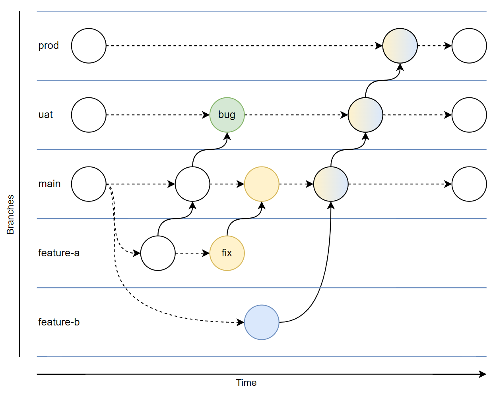

# pr-example-github

## Workflow

This repository uses a feature branch development workflow with environment branches for prod and optionally uat.



### Branches

**prod** | **uat** | **main** | **feature-*xyz***
---- | ---- | ---- | ---- 
The last configuration deployed to production. | Optional quality assurance gate before production. | Collection of safe and tested configurations desired in production. | A new, untested configuration.

### Lifecycle
- The main branch and each environment branch are long running.
- Each feature branch starts from main and is deleted when merged (via uat) into production.

### Checks
- Automated tests are triggered by any PR into main.
- Merges into main can only occur once automated tests pass.
- There are no automated checks on any other branch.

### Environments
- If uat is used it cannot be skipped.
- Each environment branch maps to an environment and merges will automatically trigger a deployment.
- Environment deployments require an approval to accommodate deployment scheduling.

### Deployment

- Authors of feature branches will deploy to development/sandpit environments manually using steps below:

``` bash
sub="<subscriptionId>"
loc="<location>"

az deployment sub create --name "main-$loc" --location $loc --subscription $sub --template-file ./src/main.bicep
``` 