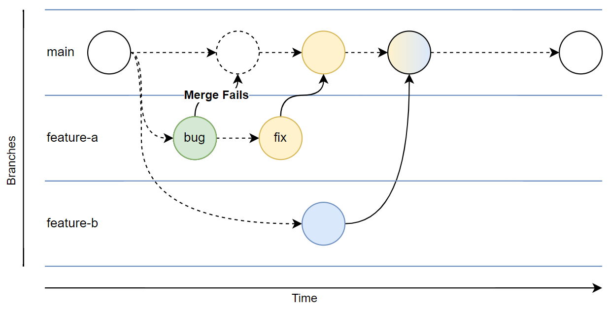

# pr-example-github

## Workflow

This repository uses feature-branch development and trunk-based deployment.



> **Note:** the following learn article describes this process comprehensively: [Review Azure infrastructure changes by using Bicep and pull requests > Understand branching](https://learn.microsoft.com/en-us/training/modules/review-azure-infrastructure-changes-using-bicep-pull-requests/2-understand-branching?pivots=github).

### Branches

**main** | **feature-*xyz***
---- | ----
Collection of safe and tested configurations desired in production. | A new, untested configuration.

### Lifecycle
- The main branch is the only long running branch.
- Each feature branch starts from main and is deleted when merged into main.

### Protection
- The main branch is protected and changes can only be made through pull requests.

### Checks
- Automated tests are triggered by any pull request into main.
- Merges into main can only occur once automated tests pass.

### Deployment
- Successful merges into main automatically trigger a deployment (to one or more environments in series or in parallel).
- Authors of feature branches will deploy to development/sandpit environments manually using steps below:

``` bash
sub="<subscriptionId>"
loc="<location>"

az deployment sub create --name "main-$loc" --location $loc --subscription $sub --template-file ./src/main.bicep
``` 